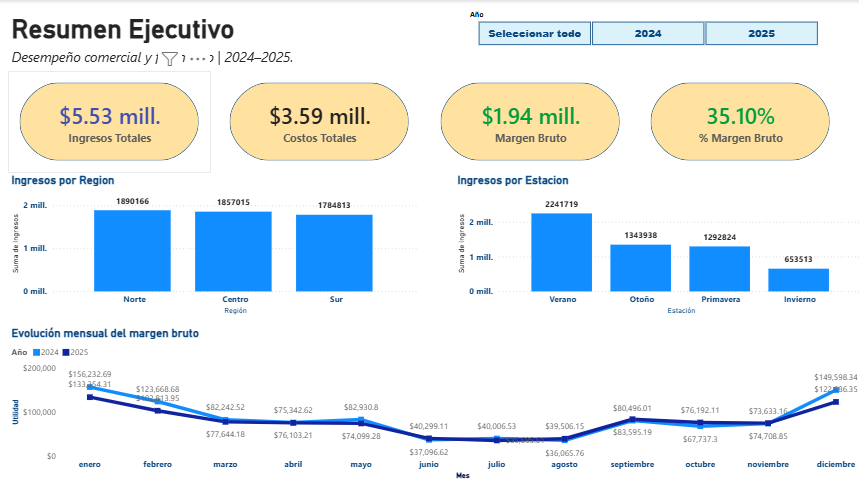
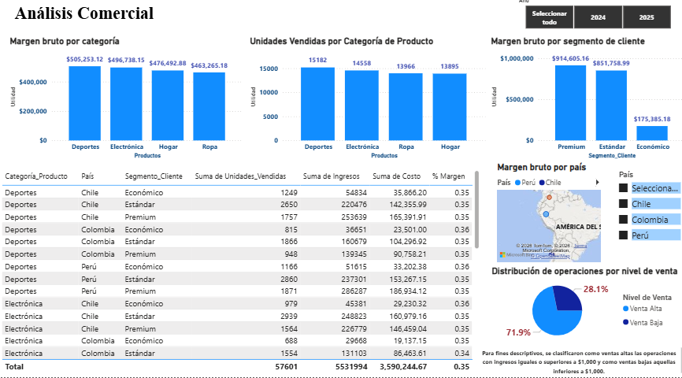

# Andes_Retail_Analysis

# Andes Retail Group | Análisis Comercial con Power BI

## 📊 Descripción del proyecto

Proyecto de Business Intelligence enfocado en analizar el desempeño comercial de **Andes Retail Group** durante el periodo **2024–2025**.

El análisis parte de una base de **5,000 operaciones comerciales** y busca transformar los datos de ventas en información útil para evaluar ingresos, costos, margen bruto, comportamiento por región, estacionalidad, categorías de producto y segmentos de clientes.

La solución fue desarrollada utilizando **Excel, Power Query, DAX y Power BI**, desde la preparación de los datos hasta la construcción de un dashboard ejecutivo e interactivo.

---

## 🎯 Objetivo

Construir una solución de análisis comercial que permita:

- Evaluar el desempeño general de ingresos, costos y margen bruto.
- Identificar diferencias de desempeño entre regiones.
- Analizar el efecto de la estacionalidad sobre los ingresos.
- Comparar categorías de producto y segmentos de clientes.
- Analizar la distribución geográfica de los resultados.
- Facilitar el seguimiento de indicadores mediante un dashboard interactivo en Power BI.

---

## 🛠️ Herramientas utilizadas

| Herramienta | Aplicación |
|---|---|
| **Excel** | Fuente y exploración inicial de los datos |
| **Power Query** | Transformación, creación de columnas y preparación de datos |
| **DAX** | Creación de medidas e indicadores |
| **Power BI** | Modelado, análisis y visualización interactiva |

---

## 🗂️ Dataset

El dataset contiene información comercial correspondiente al periodo **enero de 2024 a diciembre de 2025**.

Principales variables analizadas:

- ID de pedido
- Fecha de pedido
- ID de cliente
- Segmento de cliente
- Región
- País
- Categoría de producto
- Estación
- Unidades vendidas
- Precio unitario
- Ingresos
- Costo

### Calidad de los datos

Durante la revisión del dataset se validaron:

- **5,000 registros**
- **3,821 clientes únicos**
- Ausencia de valores nulos
- Ausencia de filas duplicadas
- IDs de pedido sin duplicados
- Ausencia de cantidades, ingresos y costos negativos
- Consistencia de `Ingresos = Unidades vendidas × Precio unitario`
- Coherencia entre ingresos y costos

Los valores extremos encontrados en volumen de unidades e ingresos se conservaron al no existir evidencia suficiente para clasificarlos como errores.

---

## 📈 KPIs principales

| KPI | Resultado |
|---|---:|
| 💰 Ingresos Totales | **$5.53 M** |
| 💵 Costos Totales | **$3.59 M** |
| 📊 Margen Bruto | **$1.94 M** |
| 📈 % Margen Bruto | **35.10%** |
| 📦 Unidades Vendidas | **57,601** |
| 🧾 Operaciones | **5,000** |
| 👥 Clientes Únicos | **3,821** |

El porcentaje de margen bruto se calcula sobre los valores agregados:

```text
Margen Bruto = Ingresos Totales - Costos Totales

% Margen Bruto = Margen Bruto / Ingresos Totales
```

---

# 📊 Dashboard

El reporte fue dividido en dos vistas principales para separar el seguimiento ejecutivo del análisis comercial detallado.

## 1️⃣ Resumen Ejecutivo

Esta página concentra los principales indicadores financieros y permite analizar el comportamiento de los resultados por región, estación y periodo.



### Principales resultados

- Los ingresos acumulados alcanzaron aproximadamente **$5.53 M**.
- El margen bruto generado fue de aproximadamente **$1.94 M**, equivalente al **35.10% de los ingresos**.
- La distribución de ingresos entre las regiones Norte, Centro y Sur es relativamente equilibrada.
- **Verano** presenta el mayor nivel de ingresos entre las estaciones analizadas.
- El análisis mensual permite comparar la evolución del margen bruto entre **2024 y 2025**.

---

## 2️⃣ Análisis Comercial

Esta página profundiza en el desempeño por categoría de producto, segmento de cliente, país y nivel de venta.



### Principales resultados

- **Deportes** presenta el mayor margen bruto entre las categorías analizadas.
- Deportes también registra el mayor volumen de unidades vendidas, aunque las cuatro categorías presentan volúmenes relativamente cercanos.
- Los segmentos **Premium y Estándar** concentran la mayor parte del margen bruto.
- El segmento **Económico** presenta una participación considerablemente menor en el margen generado.
- El análisis geográfico permite explorar los resultados de **Chile, Colombia y Perú**.
- La clasificación por nivel de venta facilita distinguir operaciones de mayor y menor importe.

---

## 💡 Insights de negocio

### 1. El desempeño regional se encuentra diversificado

Los ingresos presentan una distribución relativamente equilibrada entre las regiones **Norte, Centro y Sur**, reduciendo la dependencia comercial de una sola región.

### 2. Existe una marcada estacionalidad

**Verano** concentra el mayor volumen de ingresos, mientras que **Invierno** presenta el menor resultado entre las estaciones analizadas.

Este comportamiento puede utilizarse como referencia para planificación de inventario, campañas comerciales y asignación de recursos.

### 3. Deportes destaca en desempeño comercial

La categoría **Deportes** lidera tanto en margen bruto como en unidades vendidas, convirtiéndose en una categoría relevante dentro del desempeño general del negocio.

### 4. Premium y Estándar concentran el margen

Los segmentos **Premium y Estándar** generan la mayor proporción del margen bruto, mientras que el segmento Económico representa una participación considerablemente menor.

Esto permite identificar segmentos prioritarios para estrategias comerciales y de retención.

---

## 🔎 Clasificación del nivel de venta

Para fines descriptivos se creó la variable `Nivel_Venta`.

Las operaciones fueron clasificadas de la siguiente manera:

```text
Ingresos >= $1,000  → Venta Alta
Ingresos <  $1,000  → Venta Baja
```

Este umbral corresponde a una **regla descriptiva utilizada para segmentar las operaciones** y no representa un límite estadístico ni una política comercial oficial.

---

## 🧮 Medidas principales

Ejemplo de las medidas utilizadas para los indicadores ejecutivos:

```DAX
Ingresos Totales =
SUM('Andes_Retail_Group_2024_2025'[Ingresos])

Costos Totales =
SUM('Andes_Retail_Group_2024_2025'[Costo])

Margen Bruto =
[Ingresos Totales] - [Costos Totales]

% Margen Bruto =
DIVIDE(
    [Margen Bruto],
    [Ingresos Totales],
    0
)
```

El uso de medidas permite que los KPIs respondan dinámicamente a los filtros aplicados dentro del reporte.

---

## 📁 Estructura del repositorio

```text
Andes_Retail_Analysis/
│
├── dashboard/
│   └── Andes_Retail_Analysis.pbix
│
├── data/
│   └── Andes_Retail_Group_2024_2025.xlsx
│
├── images/
│   ├── resumen_ejecutivo.png
│   └── analisis_comercial.png
│
└── README.md
```

---

## ⚠️ Consideraciones y limitaciones

- El análisis se limita al periodo **2024–2025** disponible en el dataset.
- El margen presentado corresponde a la diferencia entre ingresos y costos registrados; no representa utilidad neta, ya que el dataset no contiene gastos administrativos, impuestos u otros gastos operativos.
- Los valores extremos fueron conservados al no existir evidencia suficiente para clasificarlos como errores.
- La clasificación de Venta Alta y Venta Baja utiliza un umbral descriptivo de **$1,000 por operación**.
- Los resultados deben interpretarse dentro del contexto y alcance del dataset disponible.

---

## 🚀 Competencias demostradas

Este proyecto demuestra experiencia práctica en:

`Power BI` · `DAX` · `Power Query` · `Excel` · `Data Analysis` · `Business Intelligence` · `Data Visualization` · `Data Cleaning` · `KPI Design` · `Retail Analytics`

---

## 👤 Autor

**Vidal del Ángel**

Proyecto desarrollado como parte de mi portafolio profesional de **Análisis de Datos y Business Intelligence**.
